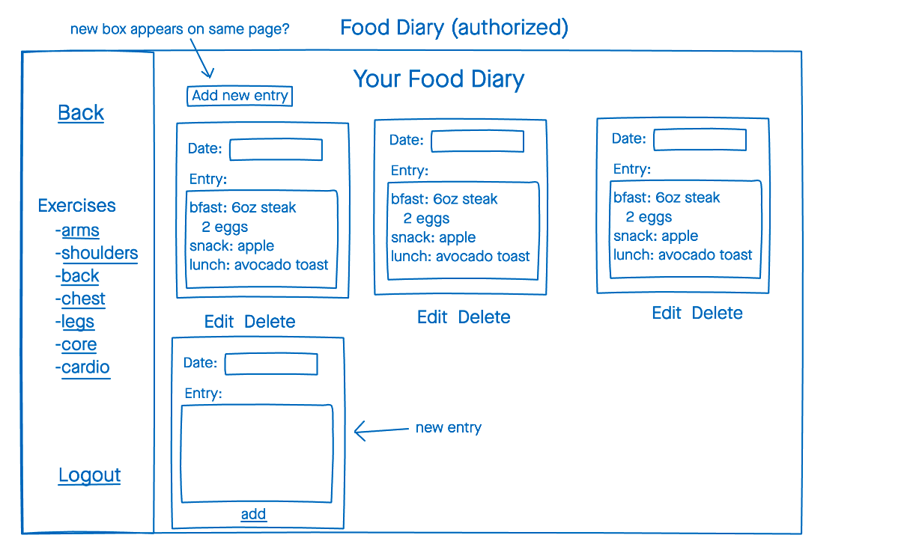
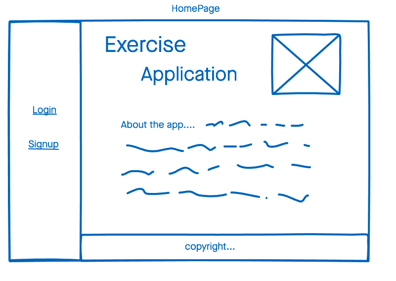
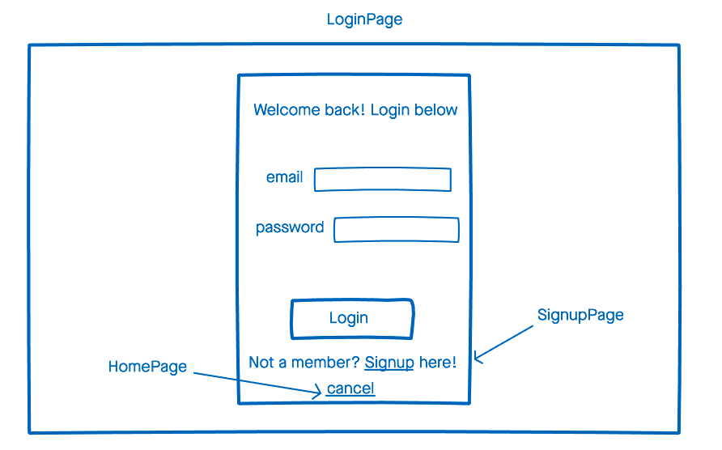
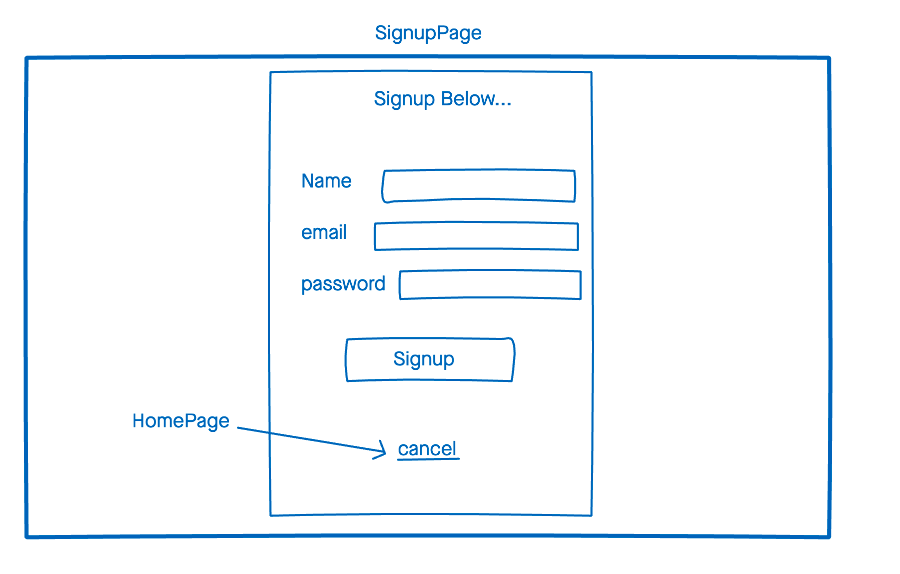
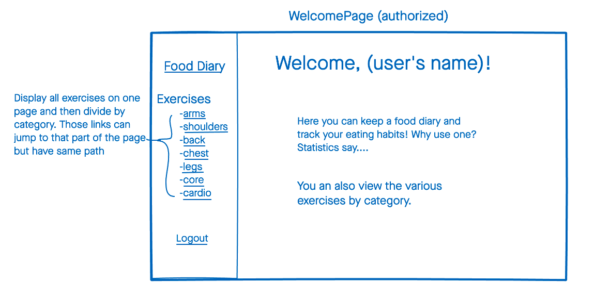
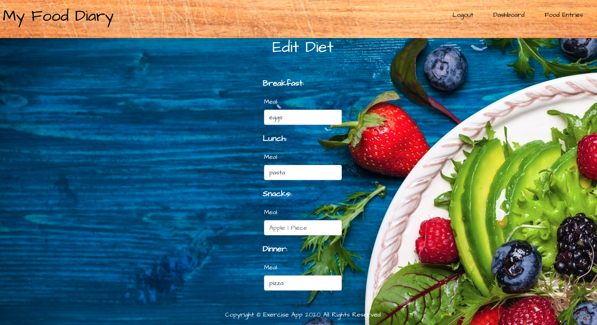
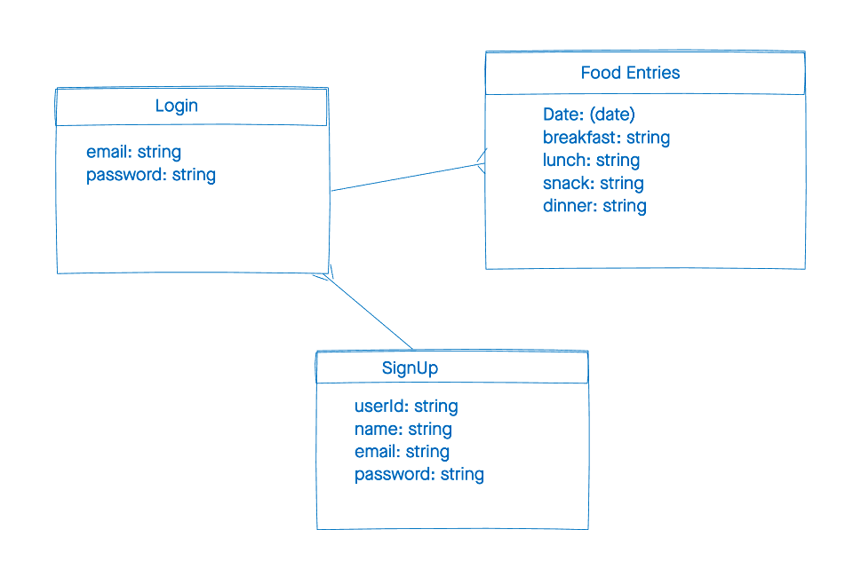

# Food Diary App
This is an application designed to keep track of your eating habits. It logs your food entries which you can add, edit, or delete your entries.

##  Installation Instructions
-  `npm i`
- create a `.env` file in the root of the project
- add the following to the `.env` file: 
```
DATABASE_URL=<database url goes here>/project3?retryWrites=true&w=majority
SECRET=<secret string goes here>
```

## Technologies Used
- HTML5
- CSS3
- JavaScript
- Express
- React
- Mongoose
- Google Fonts
- MongoDB


## Wireframes







## Screenshots




## ERD


## Getting Started
[Click Here]() to see the deplyed app!

## Future Enhancements
- Add an exercise page
- Add a third party API displaying exercises

## Obstacles
- Snack entry is not being saved
- Logout link disappears when an entry is deleted