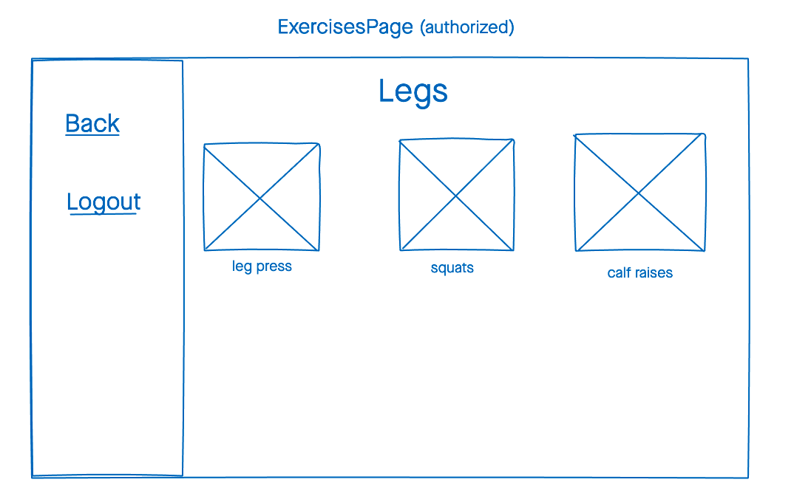

# Exercise App

##  Installation Instructions
-  `npm i`
- create a `.env` file in the root of the project
- add the following to the `.env` file: 
```
DATABASE_URL=<database url goes here>/project3?retryWrites=true&w=majority
SECRET=<secret string goes here>
```

## Wireframes




